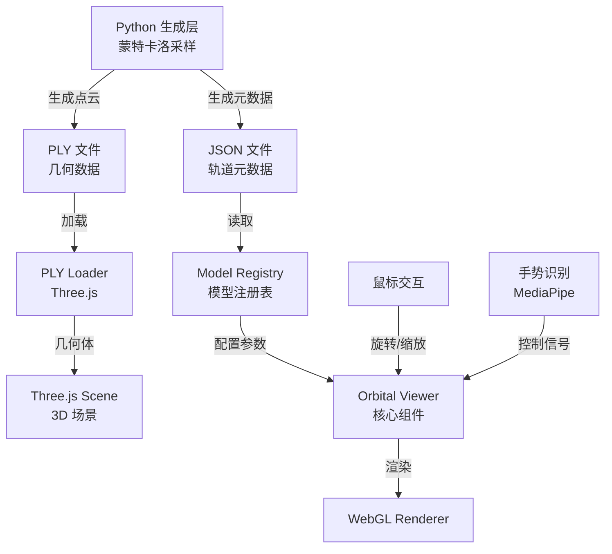

# Lorbital 架构文档

## 概述

本文档描述 Lorbital 项目的完整架构设计，包括数据流、模块职责、技术选型与核心约束。

---

## 三层架构

项目采用清晰的三层分离架构：

```
┌─────────────────────────────────────────┐
│  生成层 (Python, 离线)                  │
│  • 蒙特卡洛采样                         │
│  • 电子云点云生成                       │
│  • 输出 DXF (制造) + PLY (展示)        │
└───────────────┬─────────────────────────┘
                │
                ▼
┌─────────────────────────────────────────┐
│  数据层 (静态资源)                      │
│  • PLY: 点云几何数据                    │
│  • JSON: 元数据（轨道类型、量子数等）   │
└───────────────┬─────────────────────────┘
                │
                ▼
┌─────────────────────────────────────────┐
│  展示层 (Web / Three.js)                │
│  • PLY 加载与渲染                       │
│  • 交互（鼠标 + 手势）                  │
│  • UI 组件                              │
└─────────────────────────────────────────┘
```

---

## 数据流图



---

## 目录结构

```
Lorbital/
├── index.html                # 主页
├── explorer.html             # 3D 探测器
├── knowledge.html            # 知识库
├── story.html                # 我们的故事
│
├── css/
│   └── shared.css            # 全局样式
│
├── src/                      # 源代码
│   ├── explorer.js           # 探测器主逻辑（入口脚本）
│   ├── components/           # UI 组件
│   │   ├── OrbitalViewer.js      # 核心 3D 查看器
│   │   ├── GestureController.js  # 手势控制器
│   │   └── ModelSelector.js      # 模型选择器
│   ├── three/                # Three.js 相关
│   │   ├── setupScene.js    # 场景初始化
│   │   ├── loadPly.js       # PLY 加载器
│   │   └── renderer.js      # 渲染循环
│   ├── gesture/              # 手势控制
│   │   ├── handTracker.js   # MediaPipe 封装
│   │   ├── gestureMapping.js # 手势→控制信号映射
│   │   └── smoothing.js     # 平滑滤波
│   ├── data/                 # 数据层
│   │   ├── modelRegistry.js # 轨道模型注册表
│   │   └── orbitalKnowledge.js
│   └── utils/
│       └── constants.js     # 常量定义
│
├── models/
│   ├── model.py             # Python 生成脚本
│   └── model++/             # PLY 模型数据（按类型分类）
│       ├── s/{orbitalId}/{orbitalId}.ply   # 如 s/1s/1s.ply
│       ├── p/{orbitalId}/{orbitalId}.ply
│       ├── d/, f/, g/       # 同理，可选 meta.json 同目录
│
├── public/
│   └── images/
│       └── story/           # 故事页图片
│
├── docs/
│   ├── AGENTS.md
│   ├── CODING_STANDARDS.md
│   ├── DATA_FORMAT.md
│   └── ORBITALS.md
├── ARCHITECTURE.md
├── CONTRIBUTING.md
└── README.md
```

---

## 核心模块说明

### 1. 生成层（Python，不在本仓库）

**职责**：
- 求解氢原子薛定谔方程
- 使用蒙特卡洛接受-拒绝采样生成点云
- 输出 PLY（几何）与元数据（JSON）

**关键约束**：
- 每个轨道可指定目标直径（mm）与点数（10⁵ ~ 10⁶）
- 使用 cKDTree 做最小点间距过滤（避免内雕爆点）
- 支持 GPU（CUDA）加速

**不在 Web 项目范围内，但必须理解其输出格式**

---

### 2. 数据层

#### 2.1 PLY 格式

**用途**：存储点云几何数据

**路径**：`models/model++/{type}/{orbitalId}/{orbitalId}.ply`  
例如：`models/model++/s/1s/1s.ply`、`models/model++/p/2px/2px.ply`、`models/model++/d/3d_dz2/3d_dz2.ply`

**内容**：
- 点的 x, y, z 坐标
- 可选：颜色信息

**加载方式**：Three.js `PLYLoader`，或通过 `modelRegistry.getPlyUrl(orbitalId)` 获取 URL

**特点**：
- 二进制或 ASCII 格式
- 适合 GPU 渲染
- 兼容玻璃内雕设备

#### 2.2 meta.json 格式

**用途**：存储轨道语义信息

**路径**：`models/model++/{type}/{orbitalId}/meta.json`（可选；缺省时 `modelRegistry.loadMetadata` 使用默认值）

**内容**：
```json
{
  "id": "1s",
  "n": 1,
  "l": 0,
  "type": "s",
  "displayName": "1s",
  "description": "基态氢原子轨道，球对称",
  "pointCount": 500000,
  "physicalDiameter": 0.529,
  "recommendedScale": 1.0,
  "color": "#00ffff",
  "opacity": 0.8
}
```

**字段说明**：
- `id`: 轨道唯一标识符
- `n`: 主量子数
- `l`: 角量子数 (0:s, 1:p, 2:d, 3:f)
- `type`: 轨道类型字符串
- `displayName`: 显示名称
- `description`: 描述文本
- `pointCount`: 点云点数
- `physicalDiameter`: 物理直径（Å，玻尔半径单位）
- `recommendedScale`: 推荐初始缩放比例
- `color`: 推荐颜色（HEX）
- `opacity`: 推荐透明度

**加载方式**：`fetch` + `JSON.parse`

详细格式说明请参考 [docs/DATA_FORMAT.md](docs/DATA_FORMAT.md)

---

### 3. 展示层

#### 3.1 Three.js 模块

**`three/setupScene.js`**
- 创建场景、相机、渲染器
- 配置 WebGL 参数
- 返回场景对象供其他模块使用

**`three/loadPly.js`**
- 封装 PLYLoader
- 处理加载错误
- 几何体居中处理
- 返回 Promise

**`three/renderer.js`**
- 渲染循环（`requestAnimationFrame`）
- 平滑插值（旋转、缩放）
- 自动旋转逻辑

#### 3.2 手势控制模块

**`gesture/handTracker.js`**
- MediaPipe Hands 封装
- 摄像头初始化
- 关键点提取

**`gesture/gestureMapping.js`**
- 手势识别结果 → 控制指令
- 单手捏合 → 旋转
- 双手捏合 → 缩放

**`gesture/smoothing.js`**
- 平滑滤波（避免抖动）
- 死区处理
- 限速处理

#### 3.3 UI 组件

**`components/OrbitalViewer.js`**
- 核心 3D 查看器类
- 集成 Three.js 场景
- 管理模型加载、切换
- 暴露控制接口（旋转、缩放）

**`components/GestureController.js`**
- 手势控制组件
- 与 MediaPipe 集成
- 转换为查看器控制指令

**`components/ModelSelector.js`**
- 模型选择器（GUI）
- 使用 lil-gui
- 按轨道类型分类

#### 3.4 数据层

**`data/modelRegistry.js`**
- 轨道模型元数据注册表
- 提供查询接口
- 支持按类型、量子数筛选

---

## 核心约束（必须遵守）

### ❌ 禁止事项

1. **禁止在浏览器端进行实时量子模拟**
   - 原因：性能不可控、稳定性差
   - 替代：使用离线生成的 PLY 文件

2. **禁止在 PLY 中嵌入元数据**
   - PLY 只存储几何信息
   - 元数据必须在 JSON 中

3. **禁止随意修改模型尺寸**
   - 尺寸是物理参数（mm）
   - 不是视觉缩放，而是真实比例

### ✅ 必须遵守

1. **模块职责清晰**
   - 每个模块只做一件事
   - 依赖关系明确

2. **数据层与展示层分离**
   - JSON 不参与渲染
   - 只用于逻辑与 UI

3. **物理真实性**
   - 模型必须忠于物理
   - 不允许艺术化扭曲

---

## 交互设计

### 鼠标交互

- **拖拽**：旋转轨道
- **滚轮**：缩放（指数缩放，平滑）

### 手势交互（可选，默认关闭）

- **单手捏合**：锁定轨道进行旋转
- **双手捏合**：动态缩放
- **必须平滑、限速、有死区**

### 自动旋转

- 无用户交互时自动旋转
- 用户交互时暂停

---

## 性能优化

### 渲染优化

1. **点云渲染**
   - 使用 `PointsMaterial`
   - `AdditiveBlending` 提升视觉效果
   - `depthWrite: false` 优化性能

2. **像素比限制**
   ```javascript
   renderer.setPixelRatio(Math.min(window.devicePixelRatio, 2))
   ```

3. **平滑插值**
   - 使用 `THREE.MathUtils.lerp`
   - 避免突变，提升体验

### 加载优化

1. **按需加载**
   - 只加载当前显示的模型
   - 不预加载所有模型

2. **错误处理**
   - PLY 加载失败时显示错误
   - 不阻塞 UI

---

## 扩展性

### 添加新轨道

1. 在 Python 层生成 PLY 与 meta.json
2. 将文件放入 `models/model++/{type}/{orbital_id}/`（PLY 命名为 `{orbital_id}.ply`，meta.json 可选）
3. 在 `modelRegistry.js` 的 `MODEL_REGISTRY` 中注册

### 添加新交互方式

1. 在 `components/OrbitalViewer` 中添加控制接口
2. 在 `gesture/` 或新模块中实现交互逻辑
3. 在页面入口中集成

---

## 部署

### 静态部署

项目为纯静态网站，可部署到：
- GitHub Pages
- Netlify
- Vercel
- 任何静态文件服务器

### 注意事项

1. 确保 `models/model++/` 目录完整上传
2. 确保浏览器支持 ES6 模块
3. 确保服务器支持 MIME 类型：
   - `.ply` → `application/octet-stream`
   - `.json` → `application/json`

---

## 技术债务与未来改进

### 已知限制

1. 当前使用 CDN 加载 Three.js（可改为本地）
2. 手势控制需要摄像头权限（可优化为可选）
3. 元数据硬编码在 `modelRegistry.js`（可改为动态加载）

### 未来方向

1. 支持模型切片视图
2. 支持多轨道对比
3. 支持 VR/AR 模式
4. 离线模式（Service Worker）

---

## 参考文档

- [CONTRIBUTING.md](CONTRIBUTING.md) - 贡献指南
- [docs/DATA_FORMAT.md](docs/DATA_FORMAT.md) - 数据格式规范
- [docs/ORBITALS.md](docs/ORBITALS.md) - 轨道类型说明
- [docs/CODING_STANDARDS.md](docs/CODING_STANDARDS.md) - 代码规范
